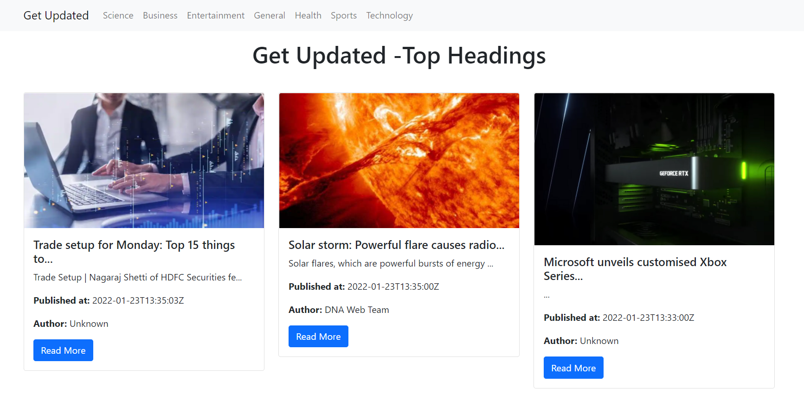

# This is how the web page looks like

# Features of website
Here you can read different current news based on different categories like science, sports, general etc.
I have used News API for fetching the current news. It gives 1000 request per day for free for learning purpose. So, if this 
website hits more than that limit, it will stop giving news. 

# Note
Because of limitation of News API this website cannot be demonstrated on live using github pages. It will work fine in local computer. 
To run it use your own api key.

# Getting Started with Create React App

This project was bootstrapped with [Create React App](https://github.com/facebook/create-react-app).

## Available Scripts

In the project directory, you can run:

### `npm start`

Runs the app in the development mode.\
Open [http://localhost:3000](http://localhost:3000) to view it in your browser.

The page will reload when you make changes.\
You may also see any lint errors in the console.
